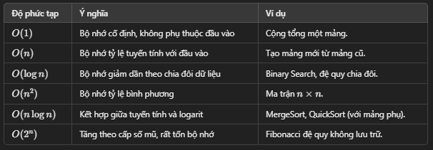

1.
    - Ở các vòng lặp khác nhau sử dụng phép cộng,
    - Ở các vòng lặp lồng nhau sử dụng phép nhân, bình phương đầu vào
2.
    - Rule1: Worst Case ->  Chỉ quan tâm trường hợp xấu nhất.
    - Rule2: Remove Constants -> Bỏ hằng số, chỉ giữ phần phụ thuộc vào đầu vào.
    - Rule3: Different terms for input -> Nếu nhiều đầu vào, giữ từng đầu vào riêng biệt (ví dụ: O(n + m)).
    - Rule4: Drop Non Dominants ->  Chỉ giữ phần có tốc độ tăng trưởng cao nhất.
3.
    - KHi viết code, làm sao để code có thể mở rộng quy mô để không phải liên tục quay lại sửa chữa mọi thứ 

    - Code good: Readable(dễ đọc), Scalable(tốc độ, bộ nhớ):
    	1.Readable(Dễ đọc):
    		Đặt tên rõ ràng, dễ hiểu.
    		Tách nhỏ logic.
    		Áp dụng code review.
    	2.Scalable(Tốc độ, bộ nhớ):
    		Memory:
    			Tránh copy dữ liệu không cần thiết.
    			Giải phóng tài nguyên không dùng đến.
    		Speed:
    			Áp dụng thuật toán hiệu quả.
    			Tránh lặp và phép tính thừa.
    			Tận dụng cache.
    - Khi một chương trình thực thi: nó có 2 cách để ghi nhớ mọi thứ: Đống(Heap) và Ngăn xếp(Stack)
	    +, Heap: thường là nơi chúng ta lưu trữ các biến mà chúng ta gán giá trị
        +, Stack: thường là nơi chúng ta theo dõi các lệnh gọi hàm của mình
    - Đôi khi chúng ta muốn tối ưu hóa đễ sử dụng ít bộ nhớ hơn thay vì sử dụng ít thời gian hơn
    - Nói về độ phức tạp của bộ nhớ hoặc không gian rất giống với việc nói về chi phí thời gian
    - Nhìn vào tổng kích thước liên quan đến kích thước của đầu vào cà xem có bao nhiêu biến mới hoặc bao nhiêu bộ nhớ mới
mà chúng tôi đang cấp phát và bao nhiêu bộ nhớ đang được sử dụng

4. Độ phức tạp về không gian

